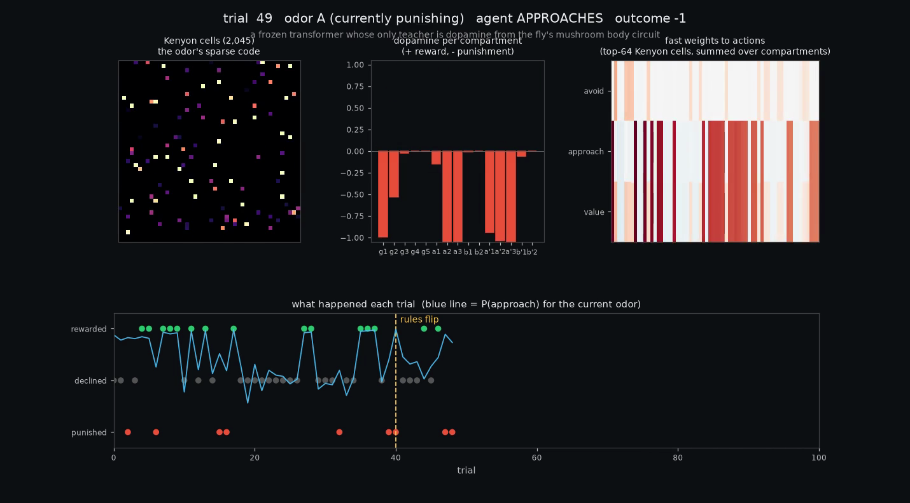

# fly-critic

A memory module for frozen neural networks, copied from the fruit fly's mushroom body and tested on whether it can teach a transformer to learn while it works.

I pulled the mushroom body circuit out of the MaleCNS v1.0 connectome (the full male fruit fly nervous system released on 2026-09-03) and used it as the plasticity system of a small frozen transformer. The circuit gives you three things - a sparse address code over about 2,000 cells, a set of adjustable wires from that code to actions, and 15 compartments with different memory lifetimes that decide what gets written and how long it lasts. The transformer's own weights never change at test time. Only those wires do, driven by a dopamine-like signal, live, during use.

Then I tried to break it. Odor tasks with rule reversals, ablations, head-to-heads against in-context RL and learned plasticity, a non-stationary bandit, Dark Room, a tool-routing task on frozen Qwen models up to 7B, POPGym, and Split-CIFAR-100. The full writeup with figures is in [report/REPORT.md](report/REPORT.md). Paper: preprint in preparation.

## Headline results

| test | fly module | what it is up against |
|---|---|---|
| odor go/no-go with reversal, dopamine as the only teacher (oracle 33.5) | 17.3 at 400 iters, 21.6 at 1200 | in-context RL, TD critic, learned plasticity on hidden state: all 0 |
| same, compartment ablation | 17.3 with 15 compartments | 12.8 with one shared timescale, 6.3 with one compartment |
| same, learned modulator on the fly architecture | 28.2 | fixed connectome dopamine 21.6 |
| non-stationary 10-arm bandit (oracle 180) | 136.7 | in-context RL 99.5, tuned sliding-window UCB 140 |
| Dark Room | 38.0 | in-context RL 31.5 |
| ToolWorld, frozen 0.5B / 1.5B LLM (oracle 105) | 24.1 / 28.0 | in-context head 17.6 / 17.5, retrieval 21.0 / 16.6, long-context 14.8 / 19.5, 7B long-context 20.2 |
| POPGym, 24 environments, equal 3M-step budget | roughly a draw with a GRU | wins RepeatFirst and the medium bandit, loses RepeatPrevious Easy and CountRecall Medium, 15 ties |
| Split-CIFAR-100, class-incremental, frozen ResNet-18 features | 7.4% - a failure | FlyModel 42.6%, replay-2000 54.6%, fine-tune 9.1% |

The last two rows are negative results and I am keeping them in. They mark exactly where the method stops working.

## What the fly contributed, and what it did not

Not the wiring. Shuffling the connectome's synapses costs about one point, a random expansion of the same size does as well as the real one, and a learned 15-channel dopamine signal beats the connectome's fixed one (28.2 vs 21.6). What survived every ablation is the architecture - the sparse conjunctive expansion code, compartmentalized fast weights, and a spread of memory lifetimes with good priors. Take away any of the three and most of the effect goes.

That architecture is built to forget on a schedule. It wins when the world changes under the agent and loses when nothing old ever becomes wrong, which is why it matches a hand-tuned bandit algorithm and then collapses on class-incremental CIFAR while its freezing-based cousin FlyModel does well. The two are one design choice apart.

## Reproduce

Everything uses [uv](https://docs.astral.sh/uv/) and Python 3.12.

```
uv sync
uv run python connectome/fetch_mb.py            # pulls the right-hemisphere mushroom body from neuPrint (no token needed) -> data/mb_R.npz
```

`data/mb_R.npz` is included, so you can skip the fetch. The odor tasks and ablations:

```
uv run python -m flycritic.train --env choice --critic mb --no_feat --pre kc --iters 400 --seed 0 --tag ch_mb_nofeat_kc_s0      # dopamine only, KC fast weights
uv run python -m flycritic.train --env choice --critic learned --pre kc --prior --iters 1200 --seed 0 --tag hh_learned_kc_prior_s0   # learned modulator (best config)
uv run python -m flycritic.train --env choice --critic mb --no_feat --pre kc --collapse --iters 400 --seed 0 --tag ch_collapse_s0    # one-compartment ablation
uv run python -m flycritic.train --env choice --critic none --iters 1200 --seed 0 --tag hh_none_s0                                  # in-context RL baseline
uv run python -m flycritic.train --env context --critic mb --pre kc --ctx_to_kc --T 200 --ent 0.03 --iters 400 --seed 0 --tag cx2_s0   # context-dependent task
```

External benchmarks:

```
uv run python -m flycritic.train --env bandit --T 200 --critic learned --pre kc --prior --iters 1500 --mb_splits 8 --seed 0 --tag b1_bandit_s0
uv run python -m flycritic.train --env darkroom --T 200 --critic learned --pre kc --prior --iters 1000 --mb_splits 8 --seed 0 --tag b1_darkroom_s0
uv run python -m flycritic.bench                                                                     # classical bandit baselines (UCB, Thompson, oracle)
uv run python -m flycritic.llm.precompute --model 0.5b --device cpu                                  # cache frozen-LLM features for ToolWorld
uv run python -m flycritic.train --env toolworld --T 120 --critic learned --pre kc --prior --iters 600 --tag tw_s0
uv run python -m flycritic.llm.eval_baselines --model 0.5b --kinds zeroshot longctx rag --chunk 2    # zero-shot / long-context / RAG baselines
uv run python -m flycritic.popgym.train --env MultiarmedBanditEasy --memory fly --steps 3000000 --epochs 8 --seed 0 --tag popgym_fly_MultiarmedBanditEasy_s0
uv run python -m flycritic.cl.data --cache && uv run python -m flycritic.cl.run --method flycritic --seed 0 --tag cl_flycritic_s0
```

Tables and figures:

```
uv run python -m flycritic.aggregate
uv run python -m flycritic.popgym.results --runs runs_popgym --complete_only
uv run python -m flycritic.cl.results
uv run python -m flycritic.figures
```

The aggregated tables from my runs are in [results/TABLES.md](results/TABLES.md) and the per-run logs are under `results/`.

A note on compute. The fast-weight replay is memory hungry - about 5 GB of GPU memory per run at 100-200 steps, and a lot more on CPU. `--mb_splits` trades speed for memory. I ran everything on AWS. The scripts and the list of ways it went wrong are in [aws/](aws/README.md).

## Layout

- `connectome/fetch_mb.py` - extracts PNs, Kenyon cells, MBONs, dopamine neurons and compartment-resolved synapse counts from neuPrint
- `flycritic/mb.py` - the mushroom body critic (sparse code, compartment-gated depression, reward-prediction-error dopamine)
- `flycritic/model.py` - the transformer with the dopamine-gated fast-weight head, plus the learned and hybrid modulators
- `flycritic/env.py` - odor tasks (go/no-go with reversal, context-dependent variant, a parked gridworld)
- `flycritic/train.py`, `evaluate.py`, `aggregate.py`, `figures.py` - PPO outer loop, evaluation, tables, plots
- `flycritic/bench.py` - non-stationary bandit and Dark Room, with classical baselines
- `flycritic/llm/` - ToolWorld, frozen-LLM features, the bridge into the module, long-context and retrieval baselines
- `flycritic/popgym/` - vectorized POPGym envs, GRU / FFM / fly memory modules under one PPO trainer, published reference numbers
- `flycritic/cl/` - Split-CIFAR-100 pipeline with fine-tune, EWC, replay, FlyModel, our module, and a joint upper bound
- `flycritic/body.py` - a working harness on the MuJoCo fruit fly body (not trained to walk - see the report)
- `report/` - the writeup and figures
- `docs/EXPERIMENT_LOG.md` - the dated log of what I did and what broke
- `aws/` - launch, watchdog and restart scripts

## Limitations

Seed variance is higher than the baselines' in every experiment. The LLM result saturates far below the oracle. The POPGym pass ran at a fifth of the paper's budget, so it cannot speak to published state of the art there. The connectome is used for its architecture, not its exact synapses, and the paper says so.

## Third-party work this depends on

- MaleCNS v1.0 connectome - HHMI Janelia FlyEM, Google Research and the Cambridge Connectomics Group, served through neuPrint
- POPGym - Morad et al., ICLR 2023, and Fast and Forgetful Memory, Morad et al. 2023
- FlyModel - Shen, Dasgupta and Navlakha, PNAS 2021
- flybody - Turaga Lab, HHMI Janelia
- Qwen2.5 models - Alibaba

## License

MIT. See [LICENSE](LICENSE). Cite with [CITATION.cff](CITATION.cff).

## demo video

`media/demo_odor_reversal.mp4` shows one episode of the dopamine-only agent - the Kenyon cells lighting up for each odor, the dopamine burst per compartment after each outcome, the fast weights changing, and the agent switching which odor it approaches after the rules flip at trial 40. Render your own from any checkpoint with `uv run python -m flycritic.viz --ckpt runs/<tag>/ckpt.pt --out demo.mp4`.


