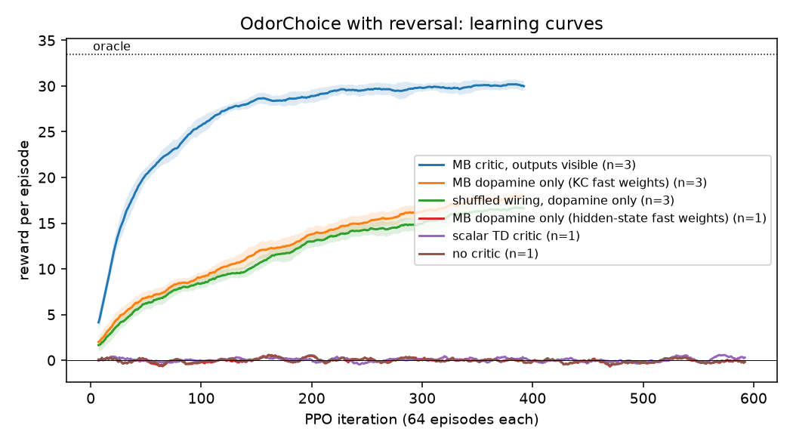
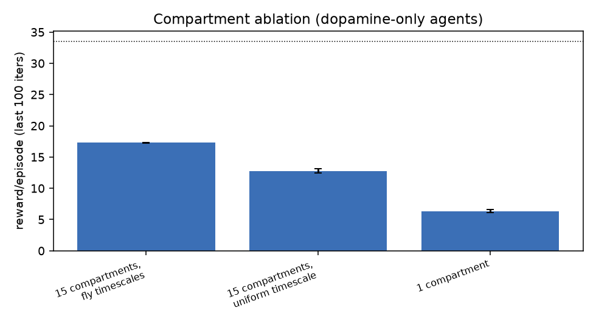
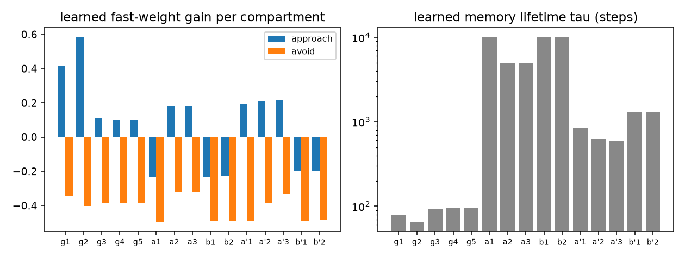
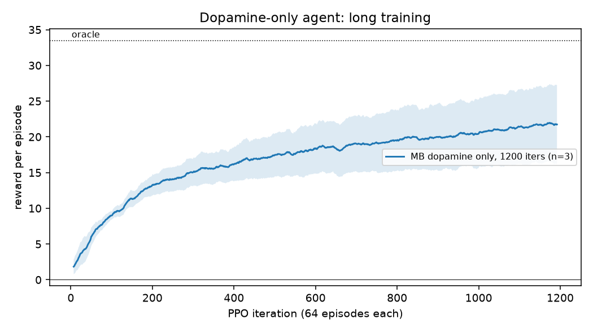
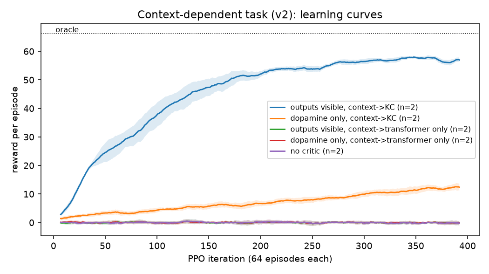
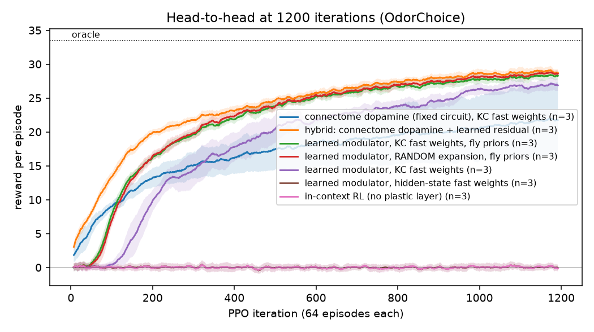
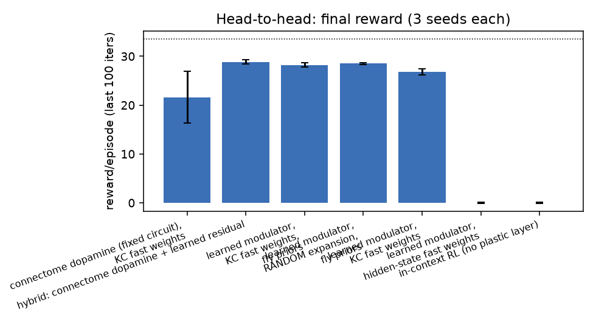
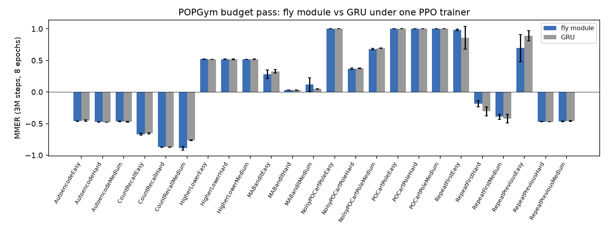

# A connectome-derived dopamine system that gates online learning in a small transformer

*Bryce Judy. Draft 2026-09-16. Code: https://github.com/bryjudy/fly-critic*

## Abstract

Dopamine in the fruit fly does not set mood; it decides what gets learned. We extract the mushroom body of the
male *Drosophila* connectome (MaleCNS v1.0, released 2026-09-03 by Google Research, HHMI Janelia and the
Cambridge Connectomics Group) and use it, unmodified in structure, as the plasticity-gating system of a small
transformer agent. The circuit's 15 dopamine compartments, each with its own learning rate and memory lifetime,
gate a three-factor Hebbian fast-weight layer inside the transformer. The transformer's slow weights are trained by
PPO across episodes; within an episode, only dopamine changes anything. On a go/no-go odor task with a mid-episode
contingency reversal, a frozen transformer whose only teaching signal is this dopamine reaches 17.3 +/- 0.1 of a
33.5 ceiling (three seeds), while a scalar TD critic, a no-critic baseline, and the same rule applied to the
transformer's own hidden state all remain at chance. Ablating the compartment structure removes most of the effect
(15 compartments 17.3 -> uniform timescales 12.8 -> single compartment 6.3), and the single-compartment agent
cannot relearn after the reversal at all. The outer loop rediscovers the fly's division of labor on its own,
assigning short lifetimes and strong approach gain to the gamma compartments and ~10^4-step lifetimes to the
alpha/beta compartments. Shuffling the connectome's specific synapses while preserving compartment structure costs
only ~1 point, and a head-to-head at 1200 iterations shows a PPO-learned 15-channel modulator *outperforms* the
connectome's fixed dopamine routing (28.2 +/- 0.4 vs 21.6 +/- 5.3) provided it is given the fly's Kenyon-cell
expansion, while the same learned modulator on the transformer's own hidden state, and in-context RL at equal
compute, both stay at zero. The connectome's contribution is therefore architectural: the sparse conjunctive
expansion code, compartmentalized multi-timescale fast weights, and good lifetime priors. Its specific dopamine
wiring is a training-free initialization, not a superior teacher. On external benchmarks with tuned baselines the
module reaches a hand-designed non-stationary bandit algorithm (136.7 vs 140) where in-context RL plateaus at
99.5 with equal training, and edges in-context RL on Dark Room (38.0 vs 31.5). Attached to a frozen 0.5B language
model on a non-stationary tool-routing task, it beats the trained in-context head, retrieval, and long-context
prompting (24.1 vs 17.6 / 21.0 / 14.8), though all remain far from the 105 oracle. On a
context-dependent variant where the same odor is rewarded in one context and punished in another, no agent learns
when the context cue reaches only the transformer, even with the critic's valence fully visible; routing the cue
into the Kenyon cells, as the fly does with its visual and thermosensory inputs, makes the sparse code an odor x
context conjunction and the same circuit reaches 57.1 of a 66 ceiling (2 seeds).

## 1. Why the fly, and why this circuit

The mushroom body is the best-characterized reinforcement circuit in any animal. Odors arrive on ~50 olfactory
channels (projection neurons, PNs), are expanded into a very sparse code across ~2,000 Kenyon cells (KCs) per
hemisphere under global feedback inhibition from the APL neuron, and are read out by ~35 types of mushroom body
output neurons (MBONs) whose activity biases approach or avoidance. About 150 dopamine neurons per hemisphere,
from the PAM (largely reward) and PPL1 (largely punishment) clusters, tile the KC axons into 15 anatomical
compartments. Dopamine released in a compartment depresses the KC->MBON synapses that were just active there.
Different compartments have different plasticity rates and memory lifetimes: the gamma lobe holds minutes, the
alpha/beta lobes hold days. This is a three-factor learning rule with a compartmentalized, multi-timescale
eligibility structure, and it is exactly the machinery a frozen network lacks.

MaleCNS v1.0 provides all of this at synapse resolution with per-compartment ROI labels and predicted
neurotransmitters, and the neuPrint query endpoint serves it without authentication.

## 2. What we built

**Circuit extraction** (`connectome/fetch_mb.py`). Right hemisphere: 124 PNs with >=3 synapses onto KCs, 2,045 KCs,
49 MBONs, 158 PAM + 8 PPL1 dopamine neurons, APL. Edges: PN->KC (194k synapses, mean 5.3 PN inputs per KC),
KC->MBON split by compartment from edge ROI data (173k synapses, 94% inside named compartments), MBON->DAN
feedback, DAN->MBON, APL<->KC. Each DAN's compartment innervation is read from its presynaptic ROI distribution;
the PAM/PPL1 share per compartment reproduces the literature (gamma1, alpha2, alpha3, alpha' lobe: punishment;
gamma3-5, beta, beta' lobes: reward).

**Critic** (`flycritic/mb.py`). KC code = top 5% of `W_pn_kc x` (APL-style inhibition), active cells ~1.
MBON_j = sum_k KC_k W_kj with W initialized from connectome synapse counts (each MBON's input normalized so a
random code drives it to ~1). Valence v = sum_j s_j MBON_j, where s_j = +1 for MBONs in PPL1-dominated
compartments (approach-driving, depressed by punishment) and -1 for PAM-dominated (avoidance-driving). Dopamine
per compartment: reward-prediction error delta = r - v, with relu(delta) routed to PAM-innervated compartments and
relu(-delta) to PPL1-innervated ones in proportion to the connectome's DAN->compartment synapse counts.
Plasticity: W_kj <- W_kj (1 - eta_c KC_k d_c) with recovery toward baseline at rate 1/tau_c, where compartment
priors are eta = 0.5/0.25/0.08 and tau = 150/800/6000 steps for gamma / alpha'beta' / alphabeta (learnable).

**Agent** (`flycritic/model.py`). 3-layer, d=128 causal transformer (0.63M params) over the episode. Output layer
y = W h + sum_c alpha_c H^c pre, with fast weights H^c (one block per compartment) updated online by
H^c <- (1 - 1/tau_c) H^c + eta_c d_c (post x pre), post = action one-hot, pre = the KC code (v2; v1 used h and
failed). Slow weights, alpha, eta, tau trained by PPO with gradients flowing through the plastic recurrence.

**Controls.** Same transformer with: MBON/valence features visible as inputs (upper bound); shuffled connectome
(degree-preserving permutation of PN->KC and of KC->MBON/compartment assignments); scalar TD-error dopamine into
a single compartment; no plastic layer (in-context learning only); and the fly dopamine gating hidden-state
fast weights instead of KC fast weights.

**Task** (`flycritic/env.py::OdorChoice`). 100 trials per episode. Three odors (patterns over the 124 real PN
channels) drawn fresh each episode: one +1, one -1, one 0. Each trial presents one odor; action 1 = approach
and receive its outcome, action 0 = avoid and receive 0. At a random trial in the middle third the +1 and -1
odors swap. Oracle = 33.5/episode.

## 3. Results

### 3.1 Dopamine alone teaches the transformer


| agent | reward/episode (last 100 iters) | seeds |
|---|---|---|
| MB critic, outputs visible | 30.0 +/- 0.3 | 3 |
| **MB dopamine only, KC fast weights** | **17.3 +/- 0.1** | 3 |
| shuffled wiring, dopamine only | 16.1 +/- 0.8 | 3 |
| MB dopamine only, hidden-state fast weights (v1) | 0 | 1 |
| scalar TD critic | 0 | 1 |
| no critic (in-context only) | 0 | 1 |

Evaluated on fresh episodes, the dopamine-only agent shows a textbook reversal curve: ~0.2 reward/step before
the swap, a perseveration dip to -0.2 immediately after (stale fast weights keep approaching the old reward
odor), recovery over ~20 trials. Agents that can read MBON valence directly recover in ~10.
(`runs/compare_v2.png`.)

### 3.2 The compartment structure is what does the work


| mushroom body variant | reward/episode | post-reversal reward | punish hits |
|---|---|---|---|
| 15 compartments, fly eta/tau priors | 17.3 +/- 0.1 | 8.5 | 11.7 |
| 15 compartments, identical eta/tau | 12.8 +/- 0.3 | 4.6 | 10.9 |
| 1 compartment | 6.3 +/- 0.2 | **-0.9** | 23.6 |

Collapsing to one compartment loses two thirds of the effect and abolishes reversal learning (post-reversal
reward is negative: the agent keeps approaching the old reward odor). Keeping 15 compartments but a single
timescale recovers half of the gap; the diversity of lifetimes supplies the rest.

### 3.3 The outer loop rediscovers the fly's division of labor


Starting from the biological priors, PPO on the slow parameters drove the gamma compartments (gamma1, gamma2,
the PPL1-innervated short-term aversive compartments) to the largest approach gains and to lifetimes of
~70-90 steps, and pushed alpha1, beta1, beta2 to ~10^4-step lifetimes with *negative* approach gain, i.e. a
slow, cautious long-term store. Nothing in the loss specified this.

### 3.4 Specific wiring vs architecture
Shuffled connectome (same neuron counts, compartment sizes and DAN tiling; specific synapses permuted) scores
16.1 +/- 0.8 vs 17.3 +/- 0.1 for the real wiring, real > shuffled on 3/3 seeds. Consistent but small: the
result is about the architecture the connectome reveals, not its exact synapses. This is what one should expect
for the PN->KC stage, which is known to be close to random in the fly.

### 3.5 Longer training: no plateau yet


Three seeds of the dopamine-only agent trained for 1200 iterations reach 21.6 +/- 5.3 (last 100 iterations) and
are still rising at the end. Two seeds are at 24-26 and climbing; one seed stalled at 14 with a lower approach
rate (16 vs 31 approaches per episode), a partial policy collapse. So 17.3 at 400 iterations understates the
mechanism; the visible-output upper bound (30) remains out of reach within this budget.

### 3.6 Context-dependent valence: the conjunctive KC code is necessary


`OdorContext`: a binary context cue is shown each trial; in context 1 the odor valences are inverted. A pure
odor->value memory averages to zero here. Episodes have 200 trials (oracle ~66) with a mid-episode reversal.
v1 of this task (context fed only to the transformer, or weakly into KCs) was a null for every agent, including
the no-critic baseline. v2 drives the context cue into a random 30% of KCs at an absolute weight of 0.1 (after
per-KC normalization of olfactory input), which makes the sparse code a genuine odor x context conjunction:
the same odor's code overlaps 41% with itself across contexts and 18% with other odors.

| agent | reward/episode (last 100 iters) | seeds |
|---|---|---|
| **MB critic, outputs visible, context -> KCs** | **57.1 +/-0.0** | 2 |
| MB dopamine only, context -> KCs | 11.3 +/- 1.0 (13.0 at end, rising) | 2 |
| MB critic, outputs visible, context -> transformer only | 0 | 2 |
| MB dopamine only, context -> transformer only | 0 | 2 |
| no critic | 0 | 2 |

Two things follow. First, the transformer cannot combine a context cue with the critic's odor valence on its own
within this budget: with context available only as a transformer input, performance is zero even when MBON valence
is fully visible. Second, when the fly-style expansion layer receives the context cue, the same circuit solves the
task, both as a visible critic (86% of ceiling) and, more slowly, as a dopamine-only teacher of KC->action fast
weights. The conjunctive sparse code that the mushroom body is known for is the ingredient that turns
"copy the critic" into "learn a context-dependent policy". This is the fly's own solution: its Kenyon cells
receive visual and thermosensory inputs alongside olfaction.

### 3.7 Head-to-head against learned-plasticity and in-context baselines


Three seeds each, 1200 iterations, same transformer, same task. The two objections a reviewer would raise are
(a) the in-context baseline was undertrained and (b) a learned modulator (Backpropamine-style) might do as well
as the fixed circuit. We test both, plus the decomposition: does a learned modulator need the fly's sparse KC
expansion, and do the fly's compartment timescale priors help it?

| agent (1200 iters, 3 seeds) | reward/episode | at iter 400 |
|---|---|---|
| **learned 15-channel modulator, KC fast weights, fly eta/tau priors** | **28.2 +/- 0.4** | 21.0 |
| learned 15-channel modulator, KC fast weights, uniform init | 26.8 +/- 0.6 | 16.3 |
| learned modulator, size-matched **random** expansion, fly priors | 28.5 +/-0.2 | |
| **hybrid**: connectome dopamine routing + learned residual (init 0) | 28.9 +/-0.4 | |
| connectome dopamine (fixed circuit), KC fast weights | 21.6 +/- 5.3 | 15.7 |
| learned modulator, hidden-state fast weights (no fly anywhere) | 0.0 +/- 0.1 | 0 |
| in-context RL, no plastic layer | 0.0 +/- 0.1 | 0 |



Four conclusions, two of them against our own initial framing:

1. **In-context RL does not solve this task at equal compute.** Three seeds, 1200 iterations (~7.7M environment
   steps), zero. The undertrained-baseline objection is answered for this budget.
2. **Learned plasticity with no fly components also fails.** A Backpropamine-style learned modulator gating
   fast weights on the transformer's own hidden state stays at zero. This is the "normal method" for this
   problem class, run at equal size, and it does not work here.
3. **A learned modulator beats the connectome's fixed dopamine routing, once it has the fly's KC expansion.**
   28.2 vs 21.6, with far lower seed variance (0.4 vs 5.3). The reward-prediction-error -> PAM/PPL1 ->
   compartment routing we lifted from the connectome is therefore *not* the active ingredient; a 15-channel
   signal learned by PPO through the plasticity does better. Our fixed circuit is best read as a strong,
   training-free initialization of that signal.
4. **The fly's timescale priors help the learned modulator too.** Initialising eta/tau from the compartment
   priors gives +1.4 at 1200 iterations and +4.7 at 400, i.e. faster learning and a slightly higher plateau.

Two follow-ups sharpen this. (5) Replacing the connectome's PN->KC wiring with a size-matched random sparse
expansion under the best learned-modulator configuration gives 28.5 +/-0.2 vs 28.2 +/- 0.4: the specific input
wiring contributes nothing measurable once the modulator is learned, consistent with 3.4. (6) The hybrid, which
starts from the connectome's dopamine routing and learns a residual correction initialized at zero, reaches
28.9 +/-0.4, i.e. PPO repairs the fixed circuit's shortfall (21.6 -> 28.9) and lands where the fully learned
modulator does. The fixed circuit is a usable initialization but confers no advantage over learning from scratch.

Together with 3.2 and 3.6, the decomposition is now clear. What the mushroom body contributes that a generic
plastic transformer lacks is (i) the sparse, high-dimensional, conjunctive Kenyon-cell code as the presynaptic
side of the plastic synapses (learned_h = 0, learned_kc = 26.8; context task 0 vs 57), (ii) compartmentalized
fast weights with a diversity of memory lifetimes (1 compartment 6.3, uniform 12.8, full 17.3), and (iii) good
priors on those lifetimes. What it does *not* contribute is a better teaching signal than gradient descent can
learn: the connectome's specific dopamine wiring is a reasonable prior, not a superior mechanism.

### 3.8 Step 1: external benchmarks against tuned baselines
Two standard tasks (a third, Dark Key-to-Door, was implemented but dropped for compute), T=200, 3 seeds per
configuration, same transformer throughout. Bandit: 1500 iterations; Dark Room: 1000.
- **10-arm non-stationary Bernoulli bandit** (best arm 0.9, others U(0,0.5), best arm flips mid-episode).
  Classical baselines tuned on this exact task: sliding-window UCB (window 100, c 0.3) **140**, discounted Thompson
  sampling (gamma 0.98) 123, random 62, oracle 180.
- **Dark Room** and **Dark Key-to-Door** from Algorithm Distillation (Laskin et al. 2022): 9x9 grid, goal fixed
  within the meta-episode, respawn every 20 (40) steps, agent sees only its position.
In-context RL is given tuned variants (default; lr 1e-3 + entropy 0.03; and on the bandit a 6-layer model) to
answer the "undertrained baseline" objection. Module configs: learned modulator + KC fast weights + fly priors, and the fixed
connectome dopamine. The KC expansion here is a fixed random projection of the observation (justified by 3.7).

| task | in-context RL (best variant, 3 seeds) | fixed connectome dopamine | learned modulator + KC (3 seeds) | classical best |
|---|---|---|---|---|
| bandit (1500 iters) | 99.5 +/- 2.3 (6-layer 95.8, high-lr 87.2) | not run (canceled for compute) | **136.7 +/- 12.9** (150 / 140 / 119) | 140 (SW-UCB); 123 (disc. TS); 62 random; 180 oracle |
| dark room (1000 iters) | 31.5 +/- 4.3 (high-lr 20.2) | 38.0 (1 seed) | **38.0 +/- 4.9** (31 / 40 / 43) | n/a |

Reading. On the bandit the module lands at the tuned classical method (136.7 vs 140, with seeds at 150, 140 and
119) and 37 points above the best in-context transformer, which received the same 1500 iterations and three
hyperparameter variants. The undertrained-baseline objection does not survive here: in-context RL plateaus near
100 on all eight runs. The module's seed variance is large (sd 12.9 vs 2.3), which is the same instability seen in
3.5. On Dark Room the module beats in-context RL by ~1.3 pooled standard deviations (38.0 vs 31.5); a modest,
consistent edge rather than a decisive one. Two low-priority configurations (fixed connectome dopamine on the
bandit, a second Dark Room seed of it) were canceled to free the GPU; Dark Key-to-Door was implemented but not run.

### 3.9 Step 2: a frozen LLM with the module, against long-context and retrieval
`ToolWorld`: a text contextual bandit. Six named tools, four query types with paraphrases; each type has a best
tool (success 0.9) whose identity is re-drawn per episode, and two of the four best tools are swapped mid-episode
("tool rotation"). Reward +1 success, -0.25 failed call, 0 for declining. T=120, oracle 105, random ~-6.
The frozen LLM (Qwen2.5-0.5B-Instruct; 1.5B/7B for baselines) reads the prompt once per trial; its final hidden
state is projected by a fixed random map into the 124 PN channels, and its zero-shot tool log-probs are given to
the policy. Nothing in the LLM is trained. Baselines that use the LLM as people actually use it:
zero-shot; **long-context** (the whole episode history in the prompt); **RAG** (8 nearest past records by hidden-
state cosine). Zero-shot 0.5B picks "Calculator" for almost everything (11% optimal), so priors do not solve it.

| agent | reward/episode (oracle 105) | post-reversal |
|---|---|---|
| 0.5B zero-shot | 12.5 | 6.9 |
| 0.5B long-context (full history in prompt) | 14.8 | 7.6 |
| 0.5B RAG (8 nearest past records by hidden-state cosine) | 21.0 | 10.8 |
| 0.5B + in-context transformer head (trained, 600 iters) | 17.6 +/- 0.1 (2 seeds) | 8.9 |
| 0.5B + fixed connectome dopamine + KC fast weights | **24.1 +/- 0.2 (2 seeds)** | 13.0 |
| 0.5B + learned modulator + KC fast weights | 23.0 +/- 0.0 (2 seeds) | 12.5 |
| **1.5B** zero-shot | 19.7 | 12.7 |
| 1.5B + in-context transformer head (trained, 600 iters) | 17.5 +/- 0.1 (3 seeds) | 8.8 |
| 1.5B + learned modulator + KC fast weights | **28.0 +/- 3.2** (3 seeds: 30/30/23) | 15.5 |
| 1.5B long-context (full history in prompt) | 19.5 | |
| 1.5B RAG (8 nearest past records) | 16.6 | |
| **7B** zero-shot | 19.9 | |
| 7B long-context (full history in prompt) | 20.2 | |
| 7B RAG (8 nearest past records) | 15.3 | |

The "bigger model with a longer prompt" comparison is now answered for this task: a frozen 7B model given its
entire interaction history scores 20.2, and with retrieval 15.3, versus 28.0 for a frozen 1.5B model with the
module and 24.1 for 0.5B with the module. Prompt-based memory barely improves on zero-shot at any size (0.5B:
12.5 -> 14.8; 1.5B: 19.8 -> 19.5; 7B: 19.9 -> 20.2), and retrieval gets worse as the model grows. The module is
the only approach here that learns from the interaction stream. Caveats: two evaluation episodes per baseline,
Qwen2.5-Instruct models only, and no prompt engineering beyond a plain history dump.

Reading (0.5B, 600 iterations, oracle 105): every learned approach beats the raw prompt-based ones, and the two
module variants (24.1, 23.0) beat the trained in-context head (17.6), RAG (21.0) and long-context (14.8). But all
of them are far from the oracle: the module learns to route ~23% of trials optimally versus 11% zero-shot. The
frozen 0.5B features plus a fixed random projection into 124 PN channels evidently carry limited query-type
information, and the plastic KC->tool associations saturate early (curves flatten by iteration ~150). This is a
modest, consistent win for the module over the standard alternatives at equal LLM size, not a solved task.
Unlike the odor tasks, the fixed connectome dopamine slightly outperforms the learned modulator here.

### 3.10 POPGym
POPGym (Morad et al., ICLR 2023) is the standard suite for memory in RL: partially observed environments where the
agent must infer or remember state, scored by MMER (max over training of the mean episodic reward, normalized to
roughly [-1, 1]). We target 24 of its environments: {MultiarmedBandit, RepeatPrevious, RepeatFirst, CountRecall,
HigherLower, Autoencode, PositionOnlyCartPole, NoisyPositionOnlyCartPole} x {Easy, Medium, Hard}. Our harness
(`flycritic/popgym/`) puts three memory modules under one variable-length PPO trainer (chunks of 128 steps, state
carried across chunks): a GRU, a faithful reimplementation of Fast and Forgetful Memory (the strongest published
POPGym memory), and the fly module (PN -> 512-KC sparse code -> 15-compartment fast weights with a learned
15-channel modulator, plus a 120-unit GRU for ordinary short-term state). Budget pass: 3M env steps per run (paper:
15M), 8 PPO epochs per batch (paper: 30), 3 seeds; published GRU MMER from the paper's appendix is the external
reference. Deviations from the paper's protocol are listed in `flycritic/popgym/results.py`.



Final budget pass (MMER over completed 3M-step runs; fly n=3 on all 24 environments; our GRU n=2-3):

| environment | fly (ours, 3M) | GRU (ours, 3M) | GRU (paper, 15M) | best (paper) |
|---|---|---|---|---|
| RepeatFirst Easy / Medium / Hard | **0.986** / -0.393 / **-0.184** | 0.860 / -0.419 / -0.306 | 1.000 / 1.000 / 0.940 | 1.000 / 1.000 / 0.969 |
| RepeatPrevious Easy / Medium / Hard | 0.695 +/- 0.22 / -0.465 / -0.469 | **0.890** / -0.461 / -0.470 | 1.000 / -0.315 / -0.428 | 1.000 / 0.789 / 0.191 (LMU) |
| MultiarmedBandit Easy / Medium / Hard | 0.281 / **0.118 +/- 0.11** / 0.032 | **0.327** / 0.048 / 0.030 | 0.619 / 0.538 / 0.516 | 0.631 / 0.598 / 0.574 |
| CountRecall Easy / Medium / Hard | -0.667 / -0.889 / -0.872 | -0.655 / **-0.763** / -0.872 | 0.177 / -0.528 / -0.475 | 0.509 / -0.519 / -0.470 |
| HigherLower Easy / Medium / Hard | 0.521 / 0.518 / 0.518 | 0.518 / 0.519 / 0.516 | 0.529 / 0.511 / 0.506 | ~0.51-0.53 |
| Autoencode Easy / Medium / Hard | -0.462 / -0.467 / -0.473 | -0.454 / -0.470 / -0.477 | -0.283 / -0.425 / -0.456 | -0.283 / -0.420 / -0.448 |
| NoisyPositionOnlyCartPole Easy / Medium / Hard | 1.000 / 0.677 / 0.368 | 1.000 / 0.693 / 0.373 | 0.995 / 0.642 / 0.390 | 0.995 / 0.659 / 0.404 |
| PositionOnlyCartPole Easy / Medium / Hard | 1.000 / 1.000 / 1.000 | 1.000 / 1.000 / 1.000 | 1.000 | 1.000 |

Reading. At equal (small) budget the fly module and the GRU are close to a draw across the suite: the module wins
RepeatFirst Easy (+0.13) and Hard (+0.12) and the medium bandit (+0.07, high variance), the GRU wins RepeatPrevious
Easy (+0.20, where the module's three seeds split 0.998 / 0.5 / 0.6), the easy bandit (+0.05) and CountRecall Medium
(+0.15); the other 15 cells are ties within noise, either both solved (CartPole, HigherLower) or both unsolved at
this budget (Autoencode, hard bandits, hard recall). The module's seed variance is again the larger. Against the
paper's 15M-step / 30-epoch GRU, both of our 3M / 8-epoch agents are far behind on bandits, CountRecall and
RepeatFirst Medium, so the budget pass says nothing about published state of the art on those families. Conclusion
for POPGym: **no takedown**. The compartmentalized fast-weight memory is competitive with a GRU as a generic RL
memory at this budget, with a possible edge on tasks that require holding one early observation (RepeatFirst) and a
deficit on tasks that need a precise rolling buffer (RepeatPrevious). A fair test against FFM and the published
numbers needs the full 15M-step protocol, roughly 5x the compute spent here.

### 3.11 Split-CIFAR-100
Class-incremental Split-CIFAR-100, 10 tasks x 10 classes, on frozen ImageNet ResNet-18 features so that the
comparison isolates the classifier/memory. Methods on identical features: naive fine-tuning, EWC (lambda 1/10/100),
experience replay (200 / 2000 exemplars), FlyModel (Shen et al. 2021), our module (sparse code -> 15-compartment
Hebbian fast weights to classes with a supervised dopamine, one pass over the data), the same with one compartment,
and a joint-training upper bound. Metrics: average accuracy after the last task, average forgetting, backward
transfer; 3 class-order seeds.

Three class-order seeds; class-incremental accuracy after 10 tasks (ACC), average forgetting, and task-incremental
accuracy; frozen ImageNet ResNet-18 features throughout; SGD methods 5 epochs/task, Hebbian methods a single pass.

| method | class-inc ACC (%) | forgetting (%) | task-inc ACC (%) |
|---|---|---|---|
| offline joint head (upper bound) | 67.4 +/- 0.1 | 10.3 | 90.6 |
| experience replay, 2000 exemplars | 54.6 +/- 0.6 | 35.3 | 87.9 |
| FlyModel (Shen et al. 2021): sparse code + Hebbian + partial freezing | **42.6 +/- 0.2** | **15.2** | 77.9 |
| experience replay, 200 exemplars | 27.2 +/- 1.3 | 69.5 | 82.5 |
| fine-tune / EWC (lambda 1, 10, 100) | 9.1 +/- 0.1 | 90.3 | 80-85 |
| fly-critic module, compartments collapsed | 8.4 +/- 0.3 | 64.0 | 69.6 |
| fly-critic module, 15 compartments (fly priors) | 7.4 +/- 0.1 | 65.6 | 69.7 |
| fly-critic module, per-compartment gains fit on task 0 | 7.4 +/- 0.1 | 65.7 | 69.6 |

Reading. A clean negative result for our module and a clean positive one for its cousin. FlyModel, built on the
same sparse expansion but *freezing* the synapses it has used, keeps 43% class-incremental accuracy with 15%
forgetting, second only to a 2,000-exemplar replay buffer and far ahead of EWC. Our module, whose defining feature is
compartmentalized *forgetting* on fixed timescales, ends at 7-8%, i.e. it recognizes roughly the most recent task
only, marginally worse than naive fine-tuning; adding compartments or fitted gains changes nothing. This is what the
design predicts: in class-incremental learning nothing old ever becomes wrong, so decaying memories are a pure
liability, and the supervised dopamine (+1 true class, -1 predicted-wrong class) keeps overwriting earlier classes'
rows. The multi-timescale architecture that pays off under contingency reversals (3.2, 3.8) is the wrong tool when
the world does not change. Task-incremental accuracy (70%) shows the representation is fine; the failure is
specifically in retaining old class boundaries. Summary: use FlyModel-style freezing for continual learning, and
fly-critic-style decay for non-stationary control. The two are one design choice apart, which is itself a useful
thing to know.

## 4. What this does and does not show
- It does show that a connectome-derived, compartmentalized dopamine system can be the *only* teacher of a frozen
  transformer's within-episode learning, and that the compartment/timescale structure is necessary for that.
- It does show that the standard alternatives fail at equal compute: in-context RL and learned neuromodulated
  plasticity on hidden state are both at zero after 1200 iterations.
- It does *not* show that the connectome's dopamine wiring is a better teacher than a learned one. It is worse
  (21.6 vs 28.2) and less stable across seeds. The durable claim is about the fly's *architecture*: sparse
  conjunctive expansion + compartmentalized multi-timescale plasticity + lifetime priors.
- It does not show that the specific synaptic wiring matters much (small consistent edge only).
- It does not reach the ceiling; dopamine-only is 17.3 at 400 iterations and 21.6 +/- 5.3 at 1200, still rising,
  with one of three seeds partially collapsing (3.5).
- On the context task, dopamine-only learning is slow (11-13 of 66 at 400 iterations) even with the conjunctive
  code; the visible-critic variant reaches 57.
- Embodied stage: harness runs end to end on DeepMind's `flybody` MuJoCo fly, but training to walk (~1e8 steps)
  was not attempted (see 5).

## 5. Next
1. Dopamine-only on the context task to convergence (>1200 iterations), and a fix for the partial-collapse seed
   (entropy floor or approach bonus).
2. Body (`flycritic/body.py`): DeepMind `flybody` walk_on_ball with this critic gating KC->motor fast weights. The
   harness trains end to end (0.22M params, 49 env steps/s single-process on an M5). Stable walking needs ~1e8
   environment steps: ~600 h at this rate, ~1-3 days with vectorized multiprocess environments on a 32-64 core box.
3. Agent: the critic gating memory writes and retry decisions in a long-running LLM agent.
4. (done, 3.7) Random expansion and hybrid follow-ups.
5. A harder benchmark family beyond odor go/no-go, and a size-matched comparison against the 2025
   Hebbian/gradient-plasticity transformer of Chen et al. on their own tasks.

## Reproduce
```
uv run python connectome/fetch_mb.py
uv run python -m flycritic.train --env choice --critic mb --no_feat --pre kc --iters 400 --seed 0 --tag ch_mb_nofeat_kc_s0
uv run python -m flycritic.aggregate ; uv run python -m flycritic.figures
```
